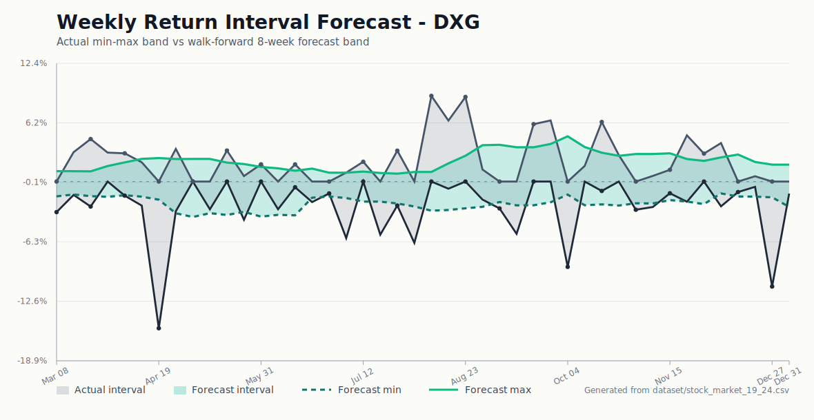

# Spatial-Temporal Stock Return Benchmark

Benchmarking code for forecasting next-week minimum and maximum stock returns
on Vietnamese HOSE equities. The project compares temporal sequence models
with spatial-temporal-like graph variants, focusing on whether cross-stock
structure improves interval-style return forecasts on a small financial
dataset.

## Highlights

- Forecast target: next-week `[min_return, max_return]` per stock.
- Input shape: rolling windows of weekly stock features, e.g. `[8 weeks, 26 stocks, 4 features]`.
- Models: LSTM, GRU, CNN-LSTM, Temporal GCN, GCN-LSTM, and GAT-LSTM.
- Graph settings: static sector graph, dynamic correlation graph, and hybrid graph variants.
- Evaluation: walk-forward / cross-validation protocols with seed-based repeated runs.
- Tuning: Optuna search with saved manifests for reproducibility.
- Framing: GAT-LSTM and GCN-LSTM are benchmarked model families, not the only focus of the repository.

## Current Result Snapshot

The main benchmark uses the `baseline4` feature set and reports mean interval
MAE across repeated walk-forward runs. Lower is better.

| Rank | Model | Graph mode | MAE mean | Runs |
|---:|---|---|---:|---:|
| 1 | CNN-LSTM | hybrid | 0.022189 | 27 |
| 2 | GAT-LSTM | hybrid | 0.023120 | 27 |
| 3 | LSTM | hybrid | 0.023248 | 27 |
| 4 | GAT-LSTM | static | 0.023650 | 27 |
| 5 | GRU | hybrid | 0.024032 | 27 |
| 6 | GCN-LSTM | static | 0.024445 | 27 |
| 7 | Temporal GCN | hybrid | 0.025437 | 27 |
| 8 | GCN-LSTM | hybrid | 0.026975 | 27 |

The interval view below is the style used to inspect forecast behaviour: the
actual min-max return band is plotted against a walk-forward forecast band.



## Repository Layout

```text
.
|-- main.py                 # CLI entrypoint for training, tuning, and benchmarks
|-- requirements.txt        # Runtime dependencies
|-- configs/                # Experiment, benchmark, and tuning presets
|-- src/                    # Reusable data, graph, model, training, and evaluation code
|-- scripts/                # Reproducible data and experiment launch helpers
|-- dataset/                # Small committed datasets plus data reports
|-- analysis/               # Exploratory analysis scripts and experiment notes
|-- notebooks/              # Exploratory notebooks
|-- docs/                   # Reports, figures, and presentation material
|-- protocols/              # Method/protocol notes
|-- outputs/                # Generated local outputs, ignored by git
`-- logs/                   # Generated experiment logs, ignored by git
```

## Quick Start

Create an environment and install dependencies:

```bash
python -m venv .venv
source .venv/bin/activate
pip install -r requirements.txt
```

On Windows PowerShell:

```powershell
python -m venv .venv
.\.venv\Scripts\Activate.ps1
pip install -r requirements.txt
```

Run a dry check of the default experiment:

```bash
python main.py --config configs/default_experiment.json --dry-run
```

Run a standard benchmark:

```bash
python main.py --mode benchmark --config configs/default_benchmark.json
```

Run Optuna tuning:

```bash
python main.py --mode tune --config configs/default_experiment.json --trials 40
```

For reproducibility notes and large-data handling, see
[docs/REPRODUCIBILITY.md](docs/REPRODUCIBILITY.md) and
[docs/DATA.md](docs/DATA.md).

## Method Summary

Daily price data is converted into weekly samples. For each stock-week, the
baseline feature set contains:

- `f_std`: weekly volatility proxy.
- `f_mean`: weekly mean price/return level.
- `f_return`: weekly log return.
- `f_skew`: distribution skewness of within-week returns.

Each model receives a rolling historical window and predicts the following
week's minimum and maximum return for each stock. The spatial-temporal-like
variants first aggregate cross-stock information through graph layers, then
model temporal dependencies with recurrent layers.

## Reproducible Experiment Helpers

The `scripts/` folder contains shell and Python wrappers for fixed experiment
presets. Examples:

```bash
bash scripts/run_final_baselines.sh
bash scripts/run_common_feature_benchmarks_3090.sh --quick
bash scripts/run_feature_window_sweep_3090.sh --quick
```

Windows users can run the feature-window sweep with:

```powershell
.\scripts\run_feature_window_sweep_3090.ps1 -Quick
```

Regenerate the README interval figure:

```bash
python scripts/plot_interval_forecast_figure.py --ticker DXG --weeks 44 --forecast-window 8
```

## Notes

This is an academic research project, not a trading system. The reported
metrics should be interpreted as controlled experimental results rather than
investment advice.
